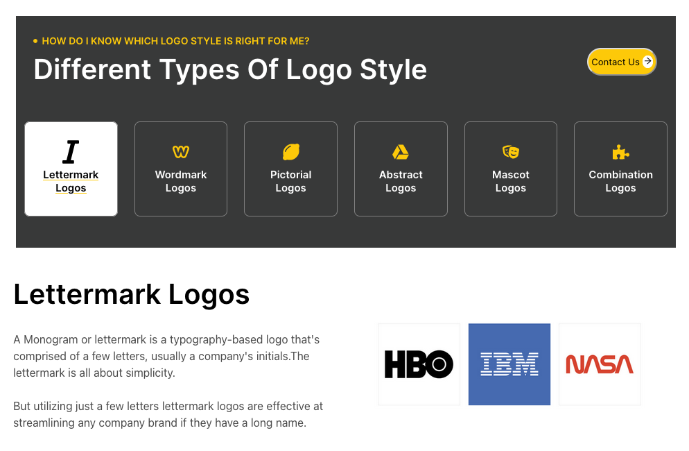

# NYTELOCK-SECTION
 
> React Project where I recreated a section of [NYTELOCK site](https://nytelock.com/logo-design-service-in-singapore/). I develop this section using Class Components, Prop-Types and deployment to gh-pages.




## Built With

- JavaScript(ES6)
- React.JS
- gh-pages
- Node.js
- prop-types
- Jest
- Enzyme

## Live Version

You can click on this [link](https://brugobi.github.io/nytelock-section/)

## Getting Started

### Prerequisites

- Node.js
- Any Brownser

To get started open the directory where you will save this repo by typing on your terminal:

```
$ cd <directory>
```

- Clone the repo typing:

```
$ git clone git@github.com:brugobi/nytelock-section.git
```
- Install dependencies:

```
$ npm install
```

### Usage

- Start the React server:

```
$ npm start
```

### Test

- To run the tests:

```
$ npm test
```

## Author

👤 **Bruna Gobi**

- Github: [@brugobi](https://github.com/brugobi)
- Twitter: [@BrunaGobi2](https://twitter.com/BrunaGobi2)
- Linkedin: [bruna-gobi](https://www.linkedin.com/in/bruna-gobi/)

## 🤝 Contributing

Contributions, issues and feature requests are welcome!

## Show your support

Give a ⭐️ if you like this project!
Feel free to check the [issues page](issues/).

## Acknowledgments

- Project requested by [NYTELOCK](https://nytelock.com/logo-design-service-in-singapore/).

## 📝 License

This project is [MIT](lic.url) licensed.